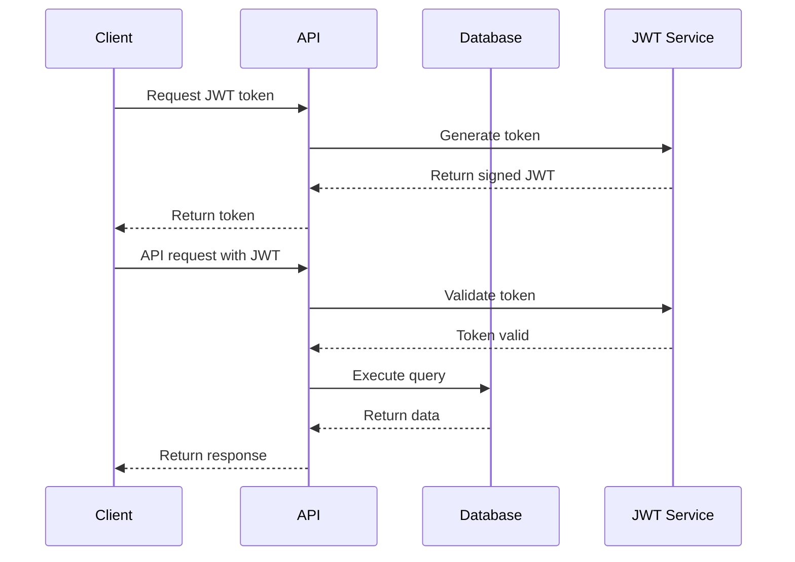
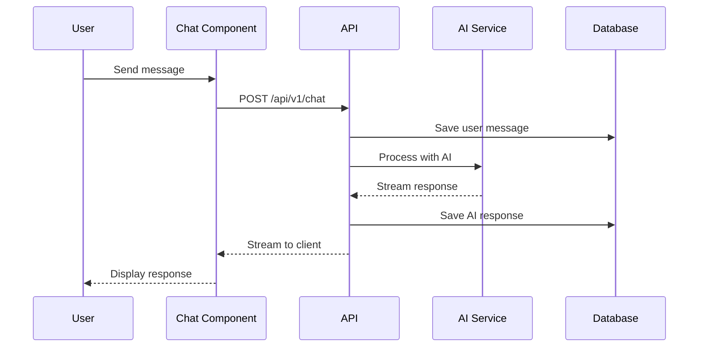
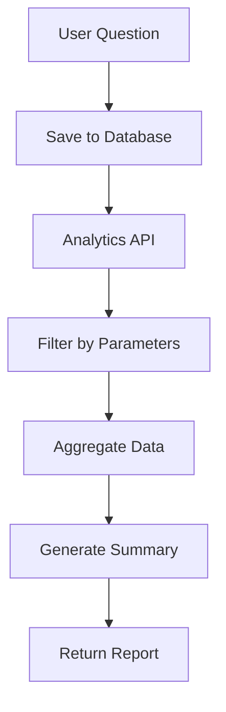

# Bluon AI Architecture Overview

Comprehensive technical architecture documentation for the Bluon AI platform.

## Table of Contents

- [System Overview](#system-overview)
- [Architecture Patterns](#architecture-patterns)
- [Technology Stack](#technology-stack)
- [Component Architecture](#component-architecture)
- [Data Flow](#data-flow)
- [Security Architecture](#security-architecture)
- [Scalability & Performance](#scalability--performance)
- [Deployment Architecture](#deployment-architecture)

## System Overview

Bluon AI is a modern, cloud-native AI-powered chatbot platform built for HVAC professionals and companies. The system is designed as a multi-tenant, scalable application with iframe integration capabilities.

### Core Principles

1. **Modularity**: Loosely coupled components for maintainability
2. **Scalability**: Horizontal scaling capabilities
3. **Security**: JWT-based authentication with CORS protection
4. **Performance**: Optimized for real-time chat interactions
5. **Reliability**: Error handling and graceful degradation

### High-Level Architecture

```
┌─────────────────────────────────────────────────────────────────┐
│                    Client Applications                          │
├─────────────────┬─────────────────┬─────────────────────────────┤
│   Web Browser   │   Mobile App    │   Third-party Integrations │
└─────────────────┴─────────────────┴─────────────────────────────┘
                            │
                    ┌───────────────┐
                    │   Load Balancer   │
                    └───────────────┘
                            │
┌─────────────────────────────────────────────────────────────────┐
│                    Next.js Application                         │
├─────────────────┬─────────────────┬─────────────────────────────┤
│   Frontend      │   API Routes    │   Server Components        │
│   (React)       │   (/api/v1)     │   (SSR/SSG)                │
└─────────────────┴─────────────────┴─────────────────────────────┘
                            │
┌─────────────────────────────────────────────────────────────────┐
│                    Service Layer                               │
├─────────────────┬─────────────────┬─────────────────────────────┤
│   Auth Service  │   Chat Service  │   Analytics Service        │
├─────────────────┼─────────────────┼─────────────────────────────┤
│   Media Service │   AI Service    │   External APIs            │
└─────────────────┴─────────────────┴─────────────────────────────┘
                            │
┌─────────────────────────────────────────────────────────────────┐
│                    Data Layer                                  │
├─────────────────┬─────────────────┬─────────────────────────────┤
│   PostgreSQL    │   Vector DB     │   File Storage             │
│   (Primary DB)  │   (Pinecone)    │   (Vercel Blob)           │
└─────────────────┴─────────────────┴─────────────────────────────┘
```

## Architecture Patterns

### 1. Layered Architecture

The application follows a 4-tier layered architecture:

```
┌─────────────────┐
│ Presentation    │ ← React Components, UI, User Interactions
├─────────────────┤
│ Application     │ ← Business Logic, API Routes, Services
├─────────────────┤
│ Domain          │ ← Core Business Models, Types, Utilities
├─────────────────┤
│ Infrastructure  │ ← Database, External APIs, File System
└─────────────────┘
```

### 2. Component-Based Architecture

React components are organized using atomic design principles:

```
components/
├── ui/           # Atoms: Basic UI elements
├── messages/     # Molecules: Combined UI elements
├── chat/         # Organisms: Complex components
└── pages/        # Templates: Layout components
```

### 3. API-First Design

All functionality is exposed through RESTful APIs:

```
/api/v1/
├── chat/         # Chat functionality
├── history/      # Chat history
├── posts/        # Analytics data
├── summary/      # AI summaries
├── transcribe/   # Audio transcription
├── tts/          # Text-to-speech
└── auth/         # Authentication
```

## Technology Stack

### Frontend Stack

| Technology        | Version | Purpose                      |
| ----------------- | ------- | ---------------------------- |
| **Next.js**       | 15.2.4  | React framework with SSR/SSG |
| **React**         | 18.3.1  | UI library                   |
| **TypeScript**    | 5.2.2   | Type safety                  |
| **Tailwind CSS**  | 4.1.7   | Styling framework            |
| **Radix UI**      | Various | Accessible UI components     |
| **Framer Motion** | 11.18.1 | Animations                   |
| **Zustand**       | 4.5.6   | State management             |
| **SWR**           | 2.3.0   | Data fetching                |

### Backend Stack

| Technology             | Version | Purpose             |
| ---------------------- | ------- | ------------------- |
| **Node.js**            | 20.8.10 | Runtime environment |
| **Next.js API Routes** | 15.2.4  | API endpoints       |
| **PostgreSQL**         | Latest  | Primary database    |
| **Drizzle ORM**        | 0.42.0  | Database ORM        |
| **Kysely**             | 0.26.3  | Query builder       |
| **Jose**               | 6.0.11  | JWT handling        |

### AI & ML Stack

| Technology     | Version | Purpose         |
| -------------- | ------- | --------------- |
| **OpenAI API** | 4.96.0  | LLM integration |
| **AI SDK**     | 4.3.16  | AI utilities    |
| **Pinecone**   | 2.2.2   | Vector database |
| **Anthropic**  | 0.18.0  | Alternative LLM |

### Infrastructure Stack

| Technology           | Purpose                |
| -------------------- | ---------------------- |
| **Vercel**           | Hosting and deployment |
| **Vercel Postgres**  | Managed PostgreSQL     |
| **Vercel Blob**      | File storage           |
| **Vercel Analytics** | Performance monitoring |

## Component Architecture

### Core Components

#### 1. Authentication System

```typescript
// lib/auth/
├── sessions.ts          # JWT verification
├── jwt-validation.ts    # Token validation
├── cors.ts             # CORS handling
└── user-service.ts     # User management
```

**Key Features:**

- JWT-based authentication
- Multi-tenant support (users, companies, partners, suppliers)
- CORS-compliant iframe integration
- Secure session management

#### 2. Chat System

```typescript
// components/chat/
├── chat.tsx            # Main chat component
├── chat-input.tsx      # Message input
├── chat-list.tsx       # Message display
├── chat-header.tsx     # Chat header
├── chat-loading.tsx    # Loading states
└── chat-sheet/         # Chat sidebar
```

**Key Features:**

- Real-time message streaming
- Voice input support
- File upload capabilities
- Message history persistence
- Typing indicators

#### 3. AI Integration

```typescript
// lib/ai/
├── prompts.ts          # System prompts
├── tools.ts            # AI tools/functions
└── streaming.ts        # Response streaming
```

**Key Features:**

- Multiple AI provider support
- Tool/function calling
- Streaming responses
- Context-aware conversations

#### 4. Database Layer

```typescript
// lib/db/
├── schema.ts           # Database schema
├── queries.ts          # Database queries
├── migrations/         # Schema migrations
└── seed.ts            # Seed data
```

**Schema Design:**

```sql
-- Core tables
users           # User accounts
companies       # Organization accounts
chats           # Chat sessions
messages        # Individual messages
questions       # Analytics data
```

### Data Models

#### User Model

```typescript
interface User {
  id: string
  email?: string
  name?: string
  companyId?: string
  partnerId?: string
  supplierId?: string
  createdAt: Date
  updatedAt: Date
}
```

#### Chat Model

```typescript
interface Chat {
  id: string
  title: string
  userId: string
  companyId?: string
  isAnonymous: boolean
  source?: string
  createdAt: Date
  updatedAt: Date
}
```

#### Message Model

```typescript
interface Message {
  id: string
  chatId: string
  role: "user" | "assistant" | "system"
  content: string
  attachments?: Attachment[]
  toolCalls?: ToolCall[]
  createdAt: Date
}
```

## Data Flow

### 1. Authentication Flow



### 2. Chat Message Flow



### 3. Analytics Data Flow



## Security Architecture

### 1. Authentication & Authorization

```typescript
// Authentication layers
┌─────────────────┐
│   JWT Token     │ ← Client authentication
├─────────────────┤
│   CORS Policy   │ ← Origin validation
├─────────────────┤
│   Rate Limiting │ ← Request throttling
├─────────────────┤
│   Input Validation │ ← Data sanitization
└─────────────────┘
```

### 2. Security Headers

```typescript
// middleware.ts - Security configuration
const securityHeaders = {
  "X-Frame-Options": "ALLOWALL",
  "Content-Security-Policy": "frame-ancestors *",
  "X-Content-Type-Options": "nosniff",
  "Referrer-Policy": "strict-origin-when-cross-origin",
}
```

### 3. Data Protection

- **Encryption**: All data encrypted in transit (HTTPS)
- **JWT Security**: HS256 algorithm with secure secret
- **Database Security**: Parameterized queries (SQL injection protection)
- **File Upload Security**: Type validation and size limits

## Scalability & Performance

### 1. Frontend Optimization

```typescript
// Performance strategies
├── Server-Side Rendering (SSR)
├── Static Site Generation (SSG)
├── Code Splitting
├── Image Optimization
├── Caching Strategies
└── Bundle Optimization
```

### 2. Backend Optimization

```typescript
// Scalability features
├── Stateless Architecture
├── Database Connection Pooling
├── Query Optimization
├── Response Caching
├── Streaming Responses
└── Horizontal Scaling
```

### 3. Database Design

```sql
-- Optimized indexes
CREATE INDEX idx_chats_user_id ON chats(user_id);
CREATE INDEX idx_messages_chat_id ON messages(chat_id);
CREATE INDEX idx_questions_created_at ON questions(created_at);
CREATE INDEX idx_questions_company_id ON questions(company_id);
```

### 4. Caching Strategy

```typescript
// Multi-level caching
┌─────────────────┐
│   Browser Cache │ ← Static assets
├─────────────────┤
│   CDN Cache     │ ← Global content delivery
├─────────────────┤
│   Application   │ ← API response caching
├─────────────────┤
│   Database      │ ← Query result caching
└─────────────────┘
```

## Deployment Architecture

### 1. Vercel Deployment

```yaml
# vercel.json configuration
{
  "framework": "nextjs",
  "buildCommand": "pnpm build",
  "outputDirectory": ".next",
  "regions": ["iad1"],
  "functions": { "app/api/v1/chat/route.ts": { "maxDuration": 60 } },
}
```

### 2. Environment Configuration

```bash
# Production environment
NEXT_PUBLIC_APP_URL=https://www.bluon.ai
DATABASE_URL=postgresql://...
JWT_SECRET_KEY=...
OPENAI_API_KEY=...
BLUON_TOKEN_KEY=...
ALLOWED_ORIGINS=...
```

### 3. CI/CD Pipeline

```yaml
# GitHub Actions workflow
name: Deploy
on:
  push:
    branches: [main]
jobs:
  deploy:
    runs-on: ubuntu-latest
    steps:
      - uses: actions/checkout@v3
      - name: Install dependencies
        run: pnpm install
      - name: Type check
        run: pnpm type-check
      - name: Build
        run: pnpm build
      - name: Deploy to Vercel
        uses: vercel/action@v1
```

### 4. Monitoring & Observability

```typescript
// Monitoring stack
├── Vercel Analytics    # Performance metrics
├── Console Logging     # Application logs
├── Error Boundaries    # React error handling
├── API Error Tracking  # Backend error monitoring
└── Database Monitoring # Query performance
```

## API Design Patterns

### 1. RESTful Design

```typescript
// Resource-based URLs
GET    /api/v1/chats          # List chats
POST   /api/v1/chats          # Create chat
GET    /api/v1/chats/:id      # Get specific chat
PUT    /api/v1/chats/:id      # Update chat
DELETE /api/v1/chats/:id      # Delete chat
```

### 2. Error Handling

```typescript
// Consistent error responses
interface APIError {
  error: {
    code: string
    message: string
    details?: any
    timestamp: string
    requestId: string
  }
}
```

### 3. Response Patterns

```typescript
// Standard response format
interface APIResponse<T> {
  data?: T
  error?: APIError
  meta?: {
    pagination?: PaginationInfo
    requestId: string
    timestamp: string
  }
}
```

## State Management

### 1. Client State (Zustand)

```typescript
// store/use-chat-store.ts
interface ChatState {
  messages: Message[]
  isLoading: boolean
  currentChatId: string | null
  addMessage: (message: Message) => void
  setLoading: (loading: boolean) => void
  clearMessages: () => void
}
```

### 2. Server State (SWR)

```typescript
// Data fetching with SWR
const { data: chats } = useSWR("/api/v1/history", fetcher)
const { data: analytics } = useSWR(
  () => `/api/v1/posts?company_id=${companyId}`,
  fetcher
)
```

### 3. Form State

```typescript
// React Hook Form for form management
const {
  register,
  handleSubmit,
  formState: { errors },
} = useForm<FormData>()
```

## Integration Patterns

### 1. iframe Integration

```typescript
// Secure iframe communication
window.addEventListener("message", (event) => {
  if (event.origin !== ALLOWED_ORIGIN) return

  if (event.data.type === "auth") {
    handleAuthentication(event.data.token)
  }
})
```

### 2. External API Integration

```typescript
// lib/api/bluon.ts - External service integration
async function handleFetch<T>(url: string): Promise<APIResponse<T>> {
  const response = await fetch(url, {
    headers: {
      Authorization: `Bearer ${process.env.BLUON_TOKEN_KEY}`,
    },
  })

  return response.json()
}
```

### 3. AI Provider Integration

```typescript
// lib/ai/providers.ts - Multiple AI provider support
interface AIProvider {
  name: string
  generateResponse: (messages: Message[]) => AsyncIterable<string>
  generateEmbedding: (text: string) => Promise<number[]>
}
```

## Testing Architecture

### 1. Testing Strategy

```typescript
// Testing pyramid
├── Unit Tests (80%)      # Individual functions/components
├── Integration Tests (15%) # API endpoints, database
└── E2E Tests (5%)        # User workflows
```

### 2. Test Organization

```
__tests__/
├── components/           # Component tests
├── api/                 # API route tests
├── utils/               # Utility function tests
├── integration/         # Integration tests
└── e2e/                # End-to-end tests
```

## Future Architecture Considerations

### 1. Microservices Evolution

```typescript
// Potential service decomposition
├── Auth Service         # User authentication
├── Chat Service         # Message handling
├── AI Service          # AI processing
├── Analytics Service   # Data analytics
├── Media Service       # File handling
└── Notification Service # Real-time updates
```

### 2. Event-Driven Architecture

```typescript
// Event sourcing pattern
interface DomainEvent {
  type: string
  aggregateId: string
  payload: any
  timestamp: Date
}
```

### 3. Caching Evolution

```typescript
// Advanced caching strategies
├── Redis Cache         # Distributed caching
├── GraphQL Cache       # Query-level caching
├── CDN Integration     # Global content delivery
└── Database Sharding   # Horizontal scaling
```

## Documentation Standards

### 1. Code Documentation

```typescript
/**
 * Generates a JWT token for chatbot authentication
 * @param userId - Unique user identifier
 * @param options - Additional token options
 * @returns Promise<JWTToken> - Signed JWT token
 * @throws {Error} - If user ID is invalid
 */
async function generateChatbotToken(
  userId: string,
  options?: TokenOptions
): Promise<JWTToken>
```

### 2. API Documentation

- OpenAPI/Swagger specifications
- Interactive API explorer
- Code examples in multiple languages
- Comprehensive error code documentation

### 3. Architecture Decision Records (ADRs)

Document significant architectural decisions:

- Context and problem statement
- Considered options
- Decision and rationale
- Consequences and trade-offs

---

_Last updated: December 2024_
_Architecture Version: 1.0.0_
