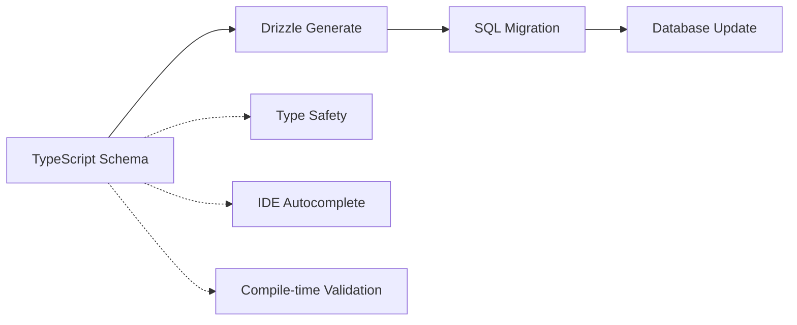

# Database Schema Documentation

This document explains the database architecture, schema, and how Drizzle ORM is used in the Bluon AI chat application.

## Overview

The application uses **PostgreSQL** as the database with **Drizzle ORM** for type-safe database operations. The database stores chat conversations, messages, user feedback, and analytics data.

## Codebase-First Database Design

This project follows a **codebase-first** approach where the TypeScript schema definitions in `lib/db/schema.ts` are the **single source of truth** for the database structure.

### How It Works



**Traditional Approach (Database-First):**

```
Database Schema → Generate Types → Application Code
```

**Our Approach (Codebase-First):**

```
TypeScript Schema → Generate Migrations → Update Database
```

### Why Codebase-First is Better

**1. Version Control Integration**

```typescript
// Schema changes are tracked in git just like any other code
export const chat = pgTable("chats", {
  id: uuid().notNull().primaryKey().defaultRandom(),
  userId: varchar("user_id"), // Added in v1.1.0
  title: varchar("title", { length: 255 }), // Increased from 100 in v1.2.0
  isAnonymous: boolean("is_anonymous").default(false), // Added in v1.3.0
})
```

**2. Type Safety from the Start**

```typescript
// Types are automatically inferred from schema
const newChat: InsertChat = {
  id: generateId(),
  userId: "user123",
  title: "My Chat",
  // TypeScript will error if required fields are missing
  // or if field types don't match the schema
}
```

**3. Code Reviews for Schema Changes**

```diff
// Schema changes go through normal PR process
export const message = pgTable("messages", {
  id: uuid().notNull().primaryKey(),
  chatId: uuid("chat_id").references(() => chat.id),
  role: varchar("role").notNull(),
+ attachments: jsonb("attachments").notNull().default([]), // New field
})
```

### The Workflow

**1. Define Schema in TypeScript**

```typescript
// lib/db/schema.ts - Single source of truth
export const newTable = pgTable("new_table", {
  id: serial().primaryKey(),
  name: varchar("name", { length: 255 }).notNull(),
  createdAt: timestamp("created_at").defaultNow(),
})
```

**2. Generate Migration**

```bash
npx drizzle-kit generate
# Creates: lib/db/migrations/0009_add_new_table.sql
```

**3. Review Generated SQL**

```sql
-- Auto-generated from TypeScript schema
CREATE TABLE "new_table" (
  "id" serial PRIMARY KEY NOT NULL,
  "name" varchar(255) NOT NULL,
  "created_at" timestamp DEFAULT now()
);
```

**4. Apply to Database**

```bash
npx drizzle-kit migrate
# Executes the SQL migration
```

### Benefits in Practice

**Collaboration:**

- No need to share database dumps or manual SQL scripts
- New developers just run `git clone` + `npm run db:migrate`
- Schema changes are documented in commit history

**Development Speed:**

- Instant autocomplete and type checking
- Catch schema mismatches at compile time, not runtime
- No need to manually sync types with database

**Deployment Safety:**

- Migrations are generated from code and reviewed
- Database changes are atomic and versioned
- Easy rollbacks using version control

### Example: Adding a New Feature

**Step 1: Update Schema (The Source of Truth)**

```typescript
// Add user preferences to chat table
export const chat = pgTable("chats", {
  // ... existing fields
  preferences: jsonb("preferences").default({}), // New field
})
```

**Step 2: Generate Types Automatically**

```typescript
// Types are instantly available
type ChatPreferences = {
  theme: "light" | "dark"
  notifications: boolean
}

// TypeScript knows about the new field
const chat: SelectChat = await getChatById(id)
chat.preferences // ✅ Type-safe access to new field
```

**Step 3: Use in Application Code**

```typescript
// Update chat with preferences
await db
  .update(chat)
  .set({
    preferences: { theme: "dark", notifications: true },
  })
  .where(eq(chat.id, chatId))
// ✅ TypeScript validates the preferences object
```

**Step 4: Generate & Review Migration**

```bash
npx drizzle-kit generate
```

```sql
-- Generated migration
ALTER TABLE "chats" ADD COLUMN "preferences" jsonb DEFAULT '{}'::jsonb;
```

### Database as Implementation Detail

The database becomes an **implementation detail** that mirrors the TypeScript schema:

```typescript
// This TypeScript definition IS the schema
export const message = pgTable("messages", {
  id: uuid().primaryKey(),
  content: text("content").notNull(),
  role: varchar("role").notNull(),
})

// Database table is automatically created to match
// No manual SQL writing required
```

### Schema Evolution

**Before (Database-First):**

1. Write SQL migration manually
2. Apply to database
3. Update TypeScript types manually
4. Hope they stay in sync

**Now (Codebase-First):**

1. Update TypeScript schema
2. Generate migration automatically
3. Types are instantly updated
4. Impossible for code and database to drift apart

This approach ensures the codebase and database are always perfectly synchronized, with TypeScript providing compile-time guarantees about data structure and operations.

## Database Folder Structure

```
lib/db/
├── schema.ts           # Drizzle table definitions and types
├── queries.ts          # Database query functions
├── migrations/         # SQL migration files
│   ├── 0001_*.sql     # Initial table creation
│   ├── 0002_*.sql     # Schema updates
│   └── meta/          # Migration metadata
└── drizzle.config.ts   # Drizzle configuration (at root)
```

## Drizzle ORM Setup

### Configuration (`drizzle.config.ts`)

```typescript
import { defineConfig } from "drizzle-kit"

export default defineConfig({
  schema: "./lib/db/schema.ts", // Where table definitions live
  out: "./lib/db/migrations", // Generated migration files
  dialect: "postgresql", // Database type
  dbCredentials: {
    url: process.env.POSTGRES_URL!, // Vercel Postgres connection
  },
})
```

### Database Connection (`queries.ts`)

```typescript
import { drizzle } from "drizzle-orm/vercel-postgres"
import { sql } from "@vercel/postgres"

const db = drizzle({ client: sql }) // Vercel Postgres client
```

## Schema Tables

### 1. **Chats Table** - Conversation Sessions

```typescript
export const chat = pgTable("chats", {
  id: uuid().notNull().primaryKey().defaultRandom(),
  userId: varchar("user_id"), // From JWT authentication
  companyId: varchar("company_id"), // Client organization
  supplierId: varchar("supplier_id"), // Business partner ID
  webuserId: varchar("webuser_id"), // Web-specific user ID
  partnerId: varchar("partner_id"), // Partner organization
  source: varchar("source"), // "buildops", "b4b", "mobile"
  title: varchar("title", { length: 255 }),
  isAnonymous: boolean("is_anonymous").default(false),
  createdAt: timestamp("created_at").notNull().defaultNow(),
  updatedAt: timestamp("updated_at").notNull().defaultNow(),
})
```

**Usage**: Each chat session gets a unique UUID. Anonymous users have `userId: null` and `isAnonymous: true`.

### 2. **Messages Table** - Individual Chat Messages

```typescript
export const message = pgTable("messages", {
  id: uuid("id").notNull().primaryKey().defaultRandom(),
  chatId: uuid("chat_id")
    .notNull()
    .references(() => chat.id, { onDelete: "cascade" }),
  role: varchar("role").notNull(), // "user" | "assistant" | "tool"
  createdAt: timestamp("created_at").notNull().defaultNow(),
  parts: json("parts").notNull(), // Message content and metadata
  data: json("data").notNull(), // Custom message data
  attachments: jsonb("attachments").notNull(), // File attachments
})
```

**Usage**: Stores both user inputs and AI responses. The `parts` field contains the actual message content and any tool invocations.

### 3. **Feedback Table** - User Ratings

```typescript
export const feedback = pgTable("feedbacks", {
  id: serial().primaryKey(),
  feedbackText: text("feedback_text").notNull(),
  voteType: varchar("vote_type", { length: 10 }).notNull(), // "upvote" | "downvote"
  createdAt: timestamp("created_at").defaultNow().notNull(),
  messageId: uuid("message_id")
    .notNull()
    .references(() => message.id, { onDelete: "cascade" }),
  chatId: uuid("chat_id")
    .notNull()
    .references(() => chat.id, { onDelete: "cascade" }),
})
```

**Usage**: Users can upvote/downvote AI responses with optional text feedback.

### 4. **Questions Table** - Analytics & Reporting

```typescript
export const question = pgTable("questions", {
  id: serial().primaryKey(),
  userId: text("user_id"),
  companyId: text("company_id"),
  query: text(), // User's question
  createdAt: timestamp("created_at").defaultNow().notNull(),
  supplierId: text("supplier_id"),
  webuserId: text("webuser_id"),
  source: text(),
  partnerId: text("partner_id"),
})
```

**Usage**: Used for analytics API endpoints (`/api/v1/posts`, `/api/v1/summary`) to track usage patterns.

## How It's Used in the Application

### 1. **Chat Creation**

```typescript
// When user starts a new conversation
export const createChat = async ({
  id,
  userId,
  companyId,
  source,
  title,
  isAnonymous,
}: InsertChat) => {
  return await db.insert(chat).values({
    id,
    userId,
    companyId,
    source,
    title,
    isAnonymous: !userId ? true : false, // Anonymous if no userId
  })
}
```

### 2. **Message Storage**

```typescript
// Save user input and AI response
export const saveMessage = async ({
  messages,
}: {
  messages: Array<InsertMessage>
}) => {
  return await db.insert(message).values(messages)
}
```

### 3. **Chat History Retrieval**

```typescript
// Load previous conversations for authenticated users
export const getAllChatsByUserId = async ({ id }: { id: string }) => {
  return await db
    .select()
    .from(chat)
    .where(eq(chat.userId, id))
    .orderBy(desc(chat.createdAt))
}
```

### 4. **Message Loading**

```typescript
// Load all messages for a specific chat
export const getMessagesByChatId = async ({ id }: { id: string }) => {
  return await db
    .select()
    .from(message)
    .where(eq(message.chatId, id))
    .orderBy(asc(message.createdAt))
}
```

## Database Indexes

Performance optimizations:

```typescript
// Chat table indexes
index("idx_chats_created_at").using("btree", table.createdAt.asc())
index("idx_chats_user_id").using("btree", table.userId.asc())

// Message table indexes
index("idx_messages_chat_id").using("btree", table.chatId.asc())
index("idx_messages_chat_id_created_at").using(
  "btree",
  table.chatId.asc(),
  table.createdAt.asc()
)
```

## Migrations

Drizzle automatically generates SQL migrations when you modify the schema:

```bash
# Generate migration after schema changes
npx drizzle-kit generate

# Apply migrations to database
npx drizzle-kit migrate
```

Example migration file (`0001_flowery_post.sql`):

```sql
ALTER TABLE "chats" ALTER COLUMN "id" TYPE uuid;
ALTER TABLE "chats" ALTER COLUMN "id" SET DEFAULT gen_random_uuid();
CREATE INDEX "idx_messages_chat_id" ON "messages" USING btree ("chat_id");
```

## Type Safety

Drizzle provides full TypeScript types:

```typescript
// Inferred types from schema
export type InsertChat = typeof chat.$inferInsert // For creating
export type SelectChat = typeof chat.$inferSelect // For reading
export type InsertMessage = typeof message.$inferInsert
export type SelectMessage = typeof message.$inferSelect
```

## Authentication Integration

The database schema supports multiple authentication contexts:

- **Anonymous users**: `userId: null`, `isAnonymous: true`
- **Authenticated users**: `userId` from JWT token
- **Company context**: `companyId`, `partnerId`, `supplierId` from JWT
- **Source tracking**: `source` field tracks integration origin

## Data Flow Example

1. **User sends message** → Creates chat (if new) → Saves user message
2. **AI processes** → Generates response → Saves assistant message
3. **User provides feedback** → Creates feedback record linked to message
4. **Analytics queries** → Aggregate data from questions table

This schema design supports both real-time chat functionality and comprehensive analytics for business intelligence.
